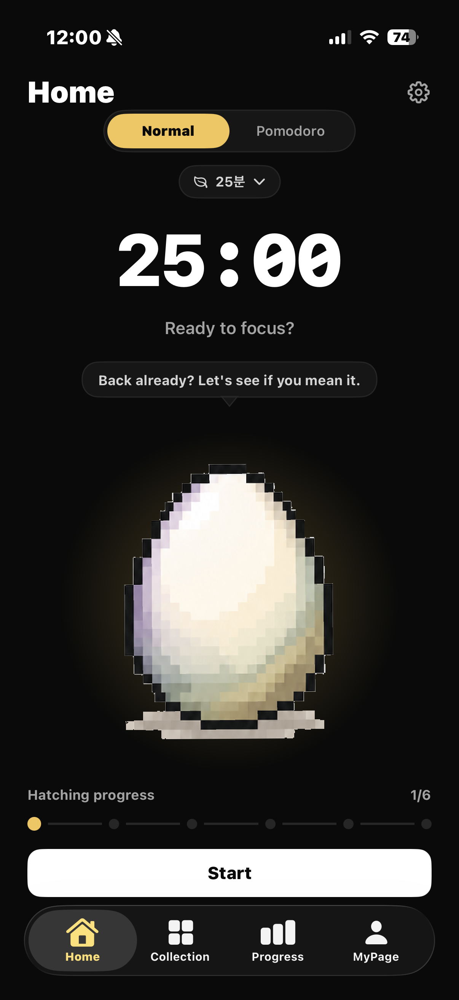
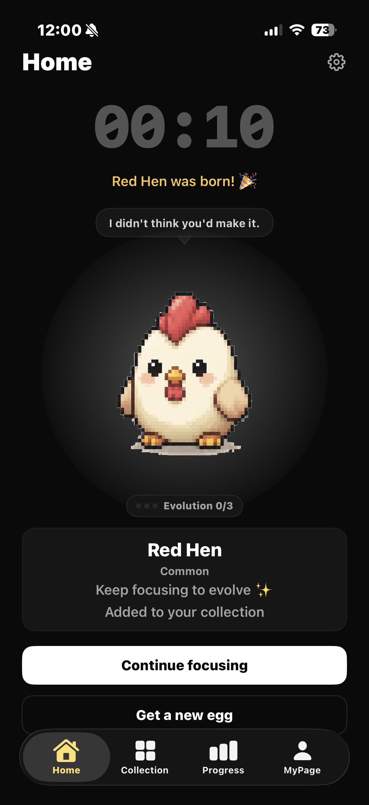
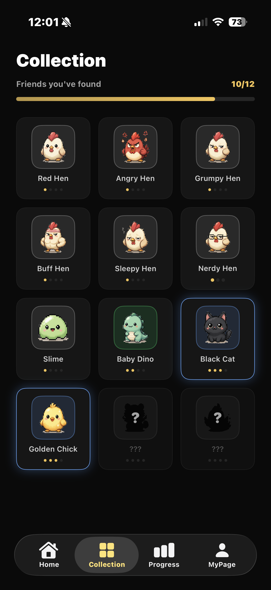

# 🥚 Hatcho — A Focus Timer That Hatches

> An iOS focus timer where finishing a study/work session hatches a pixel creature to collect.
> Solo project — planning, design, and engineering all done by one person.

<p align="center">
  
  
  
</p>

---

## Overview

**Hatcho** (formerly Studymon) started from one hypothesis: instead of "enduring" a plain timer,
what if focusing itself became rewarding? During a session, an egg cracks stage by stage; finish
the session and it hatches into a creature. Keep focusing and the creature evolves, and every
creature you've ever hatched stays in your collection. The core bet is that a gamified loop beats
a bare Pomodoro timer at holding attention.

- **Solo-built end to end**: product spec (PRD) → UI/UX design → SwiftUI implementation → backend (Supabase) → testing → App Store submission
- **Timeline**: since 2026-06 (actively developed, 75+ commits)
- **Platform**: iOS (SwiftUI, iOS 26+)
- **How it's built**: most features were shipped through a **self-designed AI agent orchestration harness** (below) — designing a safe way to run AI development autonomously is itself a deliverable of this project, separate from the app.

---

## 🤖 AI Development Harness (Designed & Built In-House)

Rather than using Claude Code as a chat-driven coding tool, I built a **spec-driven pipeline in Python that runs multiple steps unattended and self-corrects on failure**, and used it to build most of this app's features (`scripts/execute.py`, `.claude/commands/harness.md`).

**Why** — handing an entire feature to an AI agent in one shot lets scope balloon unchecked, makes failures untraceable, and loses prior decisions across sessions. I built an executor to enforce discipline programmatically instead of relying on prompting alone.

**Design**

| Component | Role |
|---|---|
| `phases/{phase}/index.json` | Tracks a phase's step list and status (`pending/completed/error/blocked`) |
| `phases/{phase}/step{N}.md` | A **self-contained spec** per step: files to read, task instructions, executable acceptance criteria, explicit "don'ts" |
| `scripts/execute.py` | Reads the specs and drives Claude Code (`claude -p`) headlessly, step by step |
| `.claude/commands/harness.md` | Slash command defining the spec-authoring rules (minimal scope per step, interface-level instructions, etc.) |

**What `execute.py` automates**
1. **Guardrail injection** — attaches the full `CLAUDE.md` + `docs/*.md` to every step's prompt, forcing the agent to re-read architecture and CRITICAL rules on every run
2. **Context accumulation** — carries forward the `summary` of every completed step into the next step's prompt, so prior decisions survive across sessions
3. **Self-correction** — on acceptance-criteria failure, feeds the error back into the retry prompt and **auto-retries up to 3 times**; if it still fails, halts in an `error` state and flags a human
4. **Blocking on human-only work** — if a step needs something the AI can't do (API keys, manual auth, etc.), it halts immediately in a `blocked` state with a reason recorded, preventing infinite retry loops
5. **Branch & commit automation** — auto-creates a `feat-{phase}` branch, splits each step into a code commit (`feat`) and a metadata commit (`chore`), and can auto-push on completion (`--push`)
6. **Status & timestamp tracking** — the executor itself records `started_at/completed_at/failed_at/blocked_at`, so progress history lives in the repo, not in my memory

```bash
python3 scripts/execute.py 4-polish        # run all pending steps in a phase, unattended
python3 scripts/execute.py 4-polish --push # ...and push the branch when done
```

The `phases/` directory (`0-ui-dummy-screens`, `3-cloud-backend`, `4-polish`, etc.) is the actual execution record produced by this harness.

---

## Key Features

| Feature | Description |
|---|---|
| 🕐 **Focus timer** | Plain mode + Pomodoro mode (25 min focus / 5 min break, auto-cycling) |
| 🥚 **Hatching loop** | Egg cracks in stages based on cumulative focus time; hatches with a 6-frame burst animation once the goal is reached |
| 🎲 **Weighted collection** | Two-stage weighted roll: rarity tier (Common/Uncommon/Rare/Legendary, weights sum to 100%) → species within that tier. Adding a new species only redistributes weight within its own tier |
| 🧬 **Staged evolution** | Hatched creatures evolve through further focus sessions; evolution stage is a derived value computed from history, not stored — no schema changes needed |
| 📖 **Collection dex** | Gallery built from hatch history, rarity-tinted cards, empty-state banner |
| 📊 **Focus stats** | Cumulative focus time and session history; a session only counts if the screen stayed on for the full duration |
| 🔔 **Local notifications** | Scheduled hatch/break alerts, focus-drift nudges (2/15/40 min), soft onboarding ask |
| 🔊 **Sound & haptics** | System sound + success haptic on hatch/evolution |
| 👤 **Sign-in & sync** | Apple / Google sign-in (Supabase Auth), bidirectional sync across devices once signed in |
| 💬 **Dialogue system** | Personality-driven tick lines per creature + narrative milestone lines |
| 🗑️ **Account deletion** | Supabase Edge Function fully cascades server-side data deletion (App Store Guideline 5.1.1(v)) |

---

## Tech Stack

| Area | Choice |
|---|---|
| UI | SwiftUI, MVVM |
| Language | Swift 5 |
| Local storage | SwiftData |
| Auth | Supabase Auth (Sign in with Apple / Google) |
| Backend | Supabase (Postgres, Row Level Security, Edge Functions) |
| Notifications | UserNotifications (local) |
| Testing | Swift Testing (`@Test`) |
| Design | Figma → SwiftUI |
| AI dev pipeline | Self-built orchestration harness (Python) driving Claude Code CLI headlessly |

---

## Architecture

```
ios/Eggtimer/
├── App/            # App entry point, global environment setup
├── Features/       # Per-screen modules (Home, Collection, Progress, MyPage, Settings, Onboarding, Dialogue, Review)
├── Components/     # Shared UI components
├── Models/         # SwiftData @Model + domain types (Creature, Rarity, FocusSession…)
├── Services/       # Supabase integration, sync, notifications, battery/screen state, etc.
└── Resources/      # Assets, constants

phases/                       # AI harness execution specs & history (per phase/step)
scripts/execute.py            # Harness executor (see above)
.claude/commands/harness.md   # Spec-authoring workflow definition
```

- **MVVM**: View ↔ ViewModel (state/logic) ↔ Model (SwiftData/domain), separating concerns
- **Service layer enforced**: all external I/O (Supabase, etc.) goes through `Services/`; views never call out directly
- **Single-entry mutations**: state changes like hatch triggering (`triggerHatch()`) and sync (`SyncCoordinator`) are funneled through single entry points to keep side effects traceable

### Data sync design
- On sign-in, local (SwiftData) and remote (Supabase Postgres) state merge via an **idempotent, id-based union**
- Remote data never blindly overwrites local state, protecting against data loss across multiple devices
- Signed-out users get a fully complete local-only experience — sign-in is optional, not required

### Data-safety principles (schema migration)
Real user data is at stake here, so these rules are enforced deliberately:
- `@Model` fields are never renamed, removed, or retyped (breaks lightweight migration → data loss on app update)
- New fields are added as optional or with defaults only; any other structural change requires a `VersionedSchema` + `SchemaMigrationPlan`, tested against old data before release
- Derived values like evolution stage are never persisted — they're computed from history, which keeps schema churn low

---

## Testing

Unit tests on core domain logic using Swift Testing (9 files, 60+ tests).

| File | Coverage |
|---|---|
| `SessionManagerTests` | Timer/Pomodoro session state transitions |
| `CreatureSpeciesTests` | Rarity tier weights (sum to 100%), effective probability |
| `SyncMergeTests` / `SyncModelsTests` | Remote-local merge logic, DTO mapping |
| `CollectionStoreTests` | Collection persistence/query |
| `DialogueTests` / `DialogueCatalogTests` | Dialogue condition matching |
| `StatsTests` | Focus stats computation |

> Integration paths that touch the SwiftData container (e.g. fetch) are verified by running on device/simulator rather than in unit tests, due to a known conflict between SwiftData fetch and the Swift Testing execution context.

---

## Backend (Supabase)

- Postgres schema + Row Level Security for per-user data isolation
- Migration history tracked in `supabase/migrations/`
- `delete-account` Edge Function cascades deletion of all related data on account removal

---

## Running It

```bash
# Open in Xcode
open ios/Eggtimer.xcodeproj

# Command-line build
xcodebuild -project ios/Eggtimer.xcodeproj -scheme Eggtimer build

# Unit tests
xcodebuild test -project ios/Eggtimer.xcodeproj -scheme Eggtimer -only-testing:EggtimerTests
```

---

## Docs

- [`docs/PRD.md`](docs/PRD.md) — Product requirements
- [`docs/ARCHITECTURE.md`](docs/ARCHITECTURE.md) — Architecture detail
- [`docs/FEATURE_DESIGN.md`](docs/FEATURE_DESIGN.md) — Feature design
- [`docs/ADR.md`](docs/ADR.md) — Key architecture decisions
- [`appstore/app-store-listing-en.md`](appstore/app-store-listing-en.md) — App Store listing copy
