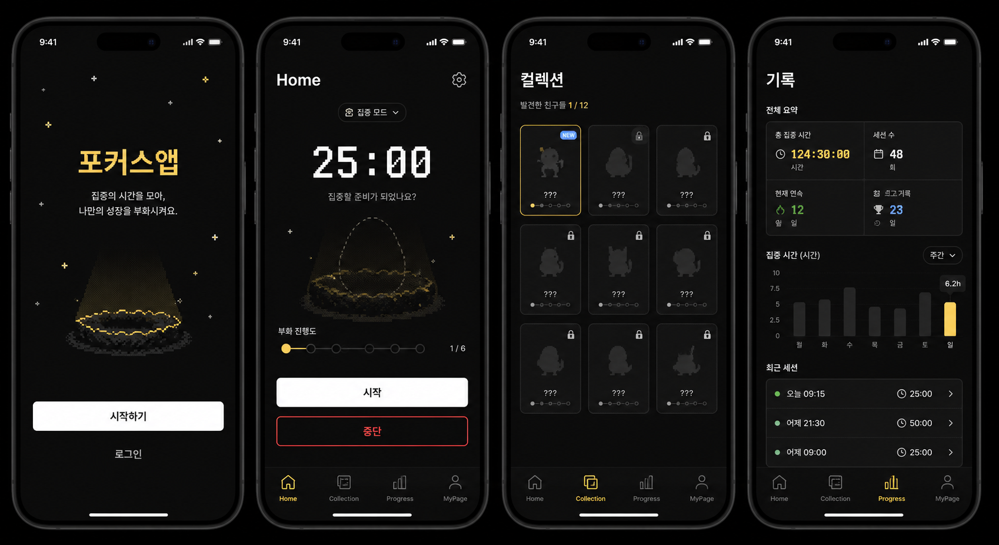

# 🥚 Hatcho — 집중하면 부화하는 타이머 앱

> 공부·업무 집중 세션을 마칠 때마다 알이 부화해 픽셀 생명체를 수집하는 iOS 집중 타이머.
> 기획·디자인·개발을 혼자 진행한 개인 프로젝트입니다.



---

## 소개

**Hatcho**(구 Studymon)는 "타이머를 그냥 견디는" 대신 "집중할수록 보상을 얻는" 경험을 만들기 위해 시작한 iOS 앱입니다.
집중 세션 동안 알에 금이 가고, 세션을 끝까지 마치면 부화해 캐릭터를 얻습니다. 캐릭터는 이어지는 집중으로 진화하고,
컬렉션에는 지금까지 만난 생명체가 쌓입니다. 단순 뽀모도로 타이머의 지루함을 게임화 루프로 해결하는 것이 핵심 가설입니다.

- **1인 개발**: 기획(PRD) → UI/UX 설계 → SwiftUI 구현 → 백엔드(Supabase) 연동 → 테스트 → App Store 제출까지 전 과정을 직접 진행
- **개발 기간**: 2026-06 ~ (지속 개발 중, 커밋 75+)
- **플랫폼**: iOS (SwiftUI, iOS 26+)
- **개발 방식**: 기능 구현 대부분을 아래 **자체 설계한 AI 에이전트 오케스트레이션 하네스**로 자율 진행 — 앱 개발과 별도로 "AI를 어떻게 안전하게 무인 운전시킬지"를 직접 설계·구현한 것이 이 프로젝트의 또 다른 산출물

---

## 🤖 AI 개발 하네스 (직접 설계·구현)

Claude Code를 단순히 "채팅으로 코드 짜는 도구"로 쓰지 않고, **명세 기반으로 여러 step을 무인 실행·자가 교정하는 파이프라인**을 Python으로 직접 만들어 이 프로젝트 대부분의 기능을 여기에 태워 개발했습니다. (`scripts/execute.py`, `.claude/commands/harness.md`)

**왜 만들었나** — 기능 하나를 통으로 AI에 맡기면 스코프가 무한정 커지고, 실패해도 원인 추적이 안 되고, 이전 결정이 다음 세션에 전달이 안 됩니다. 이를 프로그램적으로 강제하기 위한 실행기를 설계했습니다.

**설계 구조**

| 구성요소 | 역할 |
|---|---|
| `phases/{phase}/index.json` | phase의 step 목록과 상태(`pending/completed/error/blocked`) 관리 |
| `phases/{phase}/step{N}.md` | step별 **자기완결적 명세**(읽어야 할 파일, 작업 지시, 실행 가능한 AC, 금지사항) |
| `scripts/execute.py` | 명세를 읽어 Claude Code(`claude -p`)를 헤드리스로 순차 호출하는 실행기 |
| `.claude/commands/harness.md` | 명세 작성 규칙(스코프 최소화, 시그니처 수준 지시 등)을 정의한 슬래시커맨드 |

**`execute.py`가 자동으로 처리하는 것**
1. **가드레일 자동 주입** — 매 step 프롬프트에 `CLAUDE.md` + `docs/*.md` 전체를 첨부해, 에이전트가 매번 아키텍처·CRITICAL 규칙을 다시 읽고 시작하도록 강제
2. **컨텍스트 누적 전달** — 완료된 step들의 `summary`를 다음 step 프롬프트에 이어붙여, 세션이 끊겨도 "이전에 뭘 했는지" 복원
3. **자가 교정(self-correction)** — AC(Acceptance Criteria) 검증 실패 시 에러 메시지를 다음 시도 프롬프트에 피드백하며 **최대 3회 자동 재시도**, 그래도 실패하면 `error` 상태로 멈추고 사람에게 알림
4. **차단 처리** — API 키·수동 인증 등 AI가 해결 불가한 경우 즉시 `blocked` 상태로 멈추고 사유 기록 (무한 루프 방지)
5. **브랜치·커밋 자동화** — `feat-{phase}` 브랜치 자동 생성, step마다 코드(`feat`)/메타데이터(`chore`) 2단계 분리 커밋, `--push` 옵션으로 완료 후 자동 push
6. **상태·타임스탬프 추적** — `started_at/completed_at/failed_at/blocked_at`을 실행기가 직접 기록해 진행 이력이 파일 자체에 남음

```bash
python3 scripts/execute.py 4-polish        # phase 내 step 순차 자율 실행
python3 scripts/execute.py 4-polish --push # 완료 후 원격 브랜치로 push까지
```

`phases/` 디렉토리(`0-ui-dummy-screens`, `3-cloud-backend`, `4-polish` 등)가 이 하네스로 실제 실행된 기록입니다.

---

## 핵심 기능

| 기능 | 설명 |
|---|---|
| 🕐 **집중 타이머** | 일반 모드 + 뽀모도로 모드(25분 집중/5분 휴식 자동 사이클) 지원 |
| 🥚 **알 부화 루프** | 누적 집중 시간 기준으로 알에 단계별 금이 가고, 목표 도달 시 6프레임 버스트 연출과 함께 부화 |
| 🎲 **확률 기반 수집** | 등급(Common/Uncommon/Rare/Legendary, 합 100%) → 등급 내 종(種) 2단계 가중치 추첨. 신규 종 추가 시 해당 등급 내부만 재분배되도록 설계 |
| 🧬 **단계 진화 시스템** | 부화 캐릭터가 이어지는 집중 세션으로 단계 진화(파생값 계산 — 스키마 변경 없이 이력에서 산출) |
| 📖 **컬렉션 도감** | 부화 이력 기반 도감, 등급별 카드 연출, 빈 상태 안내 배너 |
| 📊 **집중 기록/통계** | 누적 집중 시간·세션 기록, 화면 유지 여부를 유효 집중 기준으로 판정 |
| 🔔 **로컬 알림** | 부화/휴식 시점 예약 알림 + 집중 이탈 넛지(2·15·40분), 온보딩 소프트 애스크 |
| 🔊 **사운드/햅틱** | 부화·진화 시 시스템 사운드 + 햅틱 피드백 |
| 👤 **로그인 & 동기화** | Apple / Google 로그인(Supabase Auth), 로그인 시 기기 간 양방향 동기화 |
| 💬 **캐릭터 대사 시스템** | 캐릭터별 성격이 담긴 tick 대사 + 서사 마일스톤 대사 풀 |
| 🗑️ **계정 삭제** | Supabase Edge Function으로 서버 데이터까지 완전 삭제 (App Store 심사 5.1.1 대응) |

---

## 기술 스택

| 영역 | 사용 기술 |
|---|---|
| UI | SwiftUI, MVVM |
| 언어 | Swift 5 |
| 로컬 저장 | SwiftData |
| 인증 | Supabase Auth (Sign in with Apple / Google) |
| 백엔드 | Supabase (Postgres, Row Level Security, Edge Functions) |
| 알림 | UserNotifications (로컬 알림) |
| 테스트 | Swift Testing (`@Test`) |
| 디자인 | Figma → SwiftUI 코드 반영 |
| AI 개발 파이프라인 | Claude Code CLI를 헤드리스로 구동하는 자체 제작 오케스트레이션 하네스 (Python) |

---

## 아키텍처

```
ios/Eggtimer/
├── App/            # 앱 진입점, 전역 환경 설정
├── Features/       # 화면 단위 모듈 (Home, Collection, Progress, MyPage, Settings, Onboarding, Dialogue, Review)
├── Components/      # 공용 UI 컴포넌트
├── Models/          # SwiftData @Model + 도메인 타입 (Creature, Rarity, FocusSession…)
├── Services/        # Supabase 연동, 동기화, 알림, 배터리/화면 상태 등 외부 연동 레이어
└── Resources/       # 에셋, 상수

phases/               # AI 하네스 실행 명세·이력 (phase/step 단위)
scripts/execute.py     # 하네스 실행기 (아래 참고)
.claude/commands/harness.md  # 명세 작성 워크플로우 정의
```

- **MVVM 기반**: View ↔ ViewModel(상태/로직) ↔ Model(SwiftData/도메인)로 관심사 분리
- **Service 레이어 강제**: 외부 통신(Supabase 등)은 반드시 `Services/`를 경유하고 View에서 직접 호출하지 않음
- **단일 소스 진입점**: 부화 트리거(`triggerHatch()`), 동기화(`SyncCoordinator`) 등 상태 변경은 단일 진입점으로 모아 사이드이펙트 추적을 쉽게 유지

### 데이터 동기화 설계
- 로그인 시 로컬(SwiftData)과 원격(Supabase Postgres) 간 **id 기준 idempotent 합집합 머지**
- 원격 데이터로 로컬을 통째로 덮어쓰지 않는 방식으로 다중 기기 사용 시 데이터 유실 방지
- 비로그인 사용자는 로컬 전용으로도 완결된 경험 제공(로그인은 선택 사항)

### 데이터 안정성 원칙 (스키마 마이그레이션)
실사용자 데이터가 걸린 부분이라 별도 규칙을 두고 지키는 중입니다.
- `@Model` 필드는 이름 변경/삭제/타입 변경 금지 (lightweight 마이그레이션 실패 → 업데이트 시 데이터 소실 방지)
- 필드 추가는 옵셔널/기본값으로만 — 그 외 구조 변경은 `VersionedSchema` + `SchemaMigrationPlan`으로 구버전 데이터 마이그레이션 검증 후 릴리스
- 진화 단계 등 파생값은 저장하지 않고 이력에서 계산 → 스키마 변경 빈도 자체를 줄임

---

## 테스트

Swift Testing 기반으로 핵심 도메인 로직에 유닛 테스트를 작성했습니다. (9개 파일, 60+ 테스트)

| 파일 | 검증 범위 |
|---|---|
| `SessionManagerTests` | 타이머/뽀모도로 세션 상태 전이 |
| `CreatureSpeciesTests` | 확률표 등급 가중치(합 100%) · 실효 확률 |
| `SyncMergeTests` / `SyncModelsTests` | 원격-로컬 머지 로직, DTO 매핑 |
| `CollectionStoreTests` | 컬렉션 저장/조회 |
| `DialogueTests` / `DialogueCatalogTests` | 대사 조건 매칭 |
| `StatsTests` | 집중 통계 계산 |

> SwiftData 컨테이너를 포함한 통합 경로(fetch 등)는 Swift Testing 실행 컨텍스트와의 이슈로 유닛 테스트 대신 실기기/시뮬레이터 실행으로 검증합니다.

---

## 백엔드 (Supabase)

- Postgres 스키마 + Row Level Security로 사용자별 데이터 격리
- 마이그레이션 이력 관리 (`supabase/migrations/`)
- `delete-account` Edge Function으로 계정 삭제 시 연관 데이터 cascade 삭제

---

## 실행 방법

```bash
# Xcode로 열기
open ios/Eggtimer.xcodeproj

# 커맨드라인 빌드
xcodebuild -project ios/Eggtimer.xcodeproj -scheme Eggtimer build

# 유닛 테스트
xcodebuild test -project ios/Eggtimer.xcodeproj -scheme Eggtimer -only-testing:EggtimerTests
```

---

## 문서

- [`docs/PRD.md`](docs/PRD.md) — 제품 요구사항
- [`docs/ARCHITECTURE.md`](docs/ARCHITECTURE.md) — 아키텍처 상세
- [`docs/FEATURE_DESIGN.md`](docs/FEATURE_DESIGN.md) — 기능 설계
- [`docs/ADR.md`](docs/ADR.md) — 주요 의사결정 기록
- [`appstore/app-store-listing-en.md`](appstore/app-store-listing-en.md) — App Store 등록 문구
